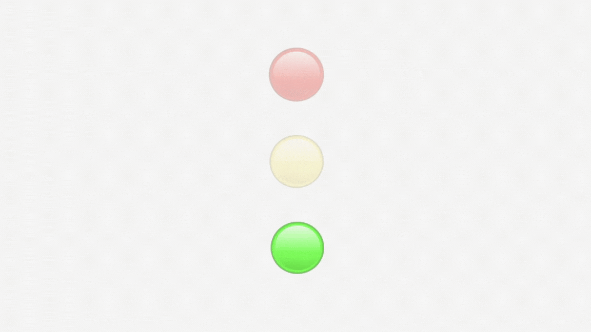
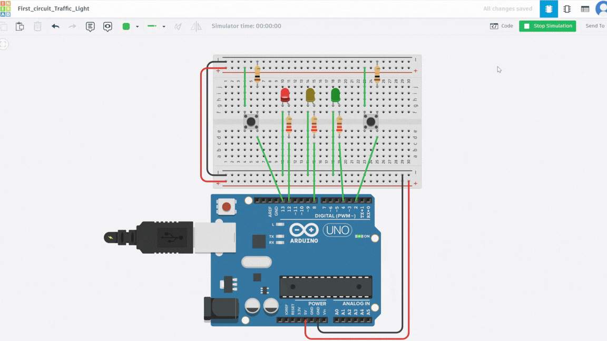

# Traffic Light LED Project

A traffic light state machine implemented in both MATLAB App Designer and Arduino, featuring advance and reset button controls.

MATLAB App Designer:
A GUI-based simulation featuring three lamps (Red, Yellow, Green) controlled by two buttons, advance button and reset button. The TrafficLight handle class manages the transitions (Red → Green → Yellow → Red), while the app enables/disables the corresponding lamp on each button press.

Arduino (TinkerCad):
A physical circuit simulation using an Arduino UNO with three LEDs and two push buttons. The Advance button cycles through the traffic light states, and the Reset button returns to Red. Edge detection ensures each button press registers only once.

## Demo
Schematic Diagram-

Matlab App demonstartion-

Tinkercad Circuit demonstartion-

## Features
- Press advance button: cycles Red → Green → Yellow
- Press reset button: returns to Red

## Components
- Arduino Uno R3
- 3x LEDs (red, yellow, green)
- 3x resistors (220 Ohms)
- 2x resistors (10 kilo ohms)
- 2x push buttons
- Breadboard + jumper wires

Brief explanation of how your code works.

## Circuit Diagram

